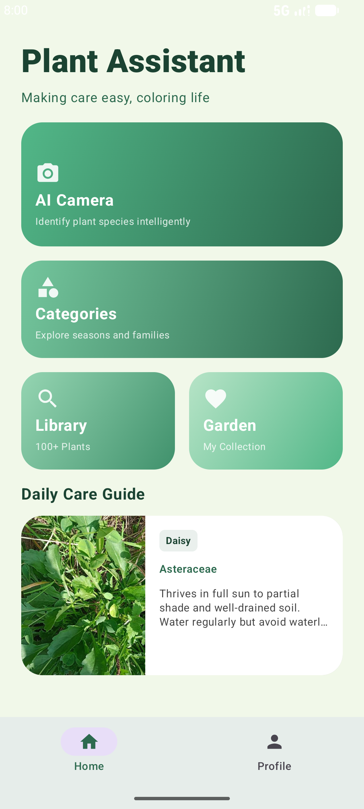
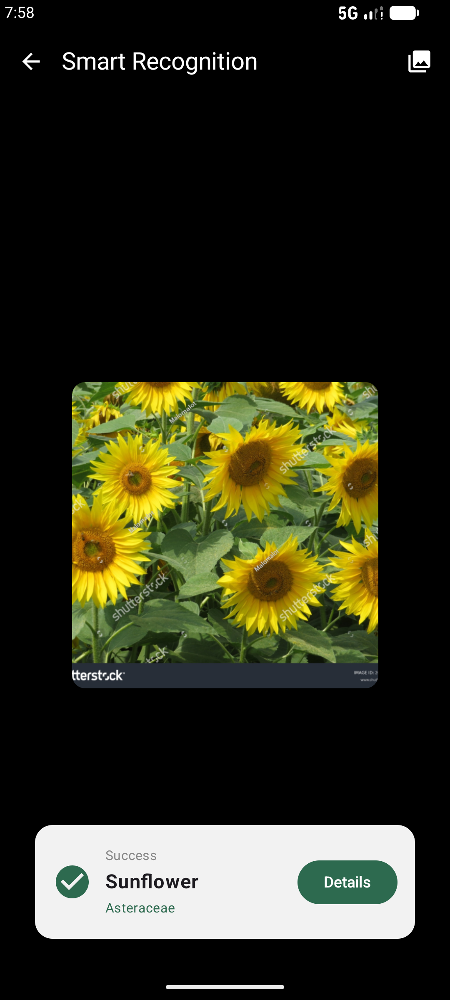
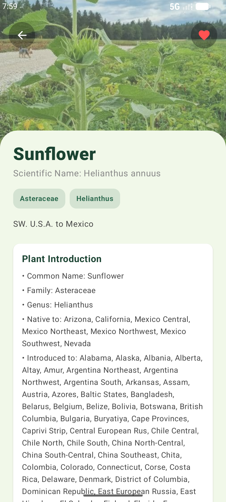
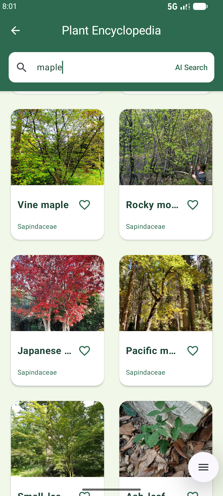
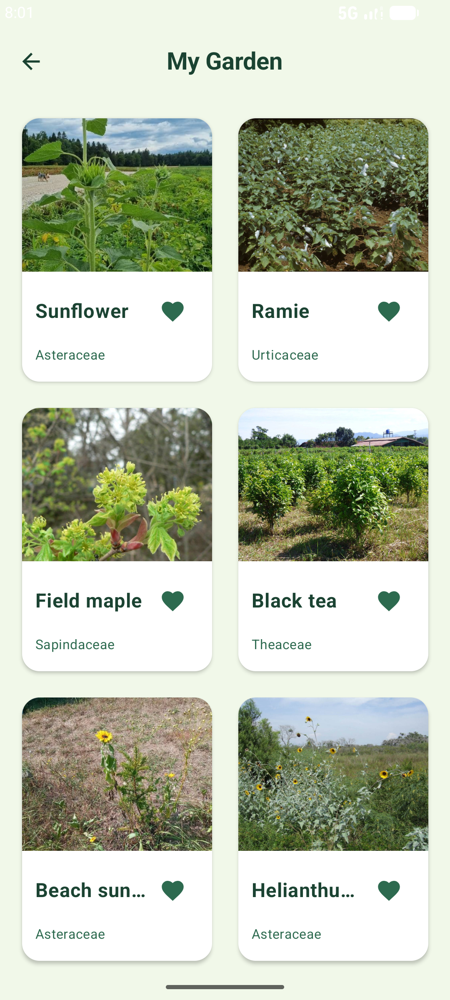
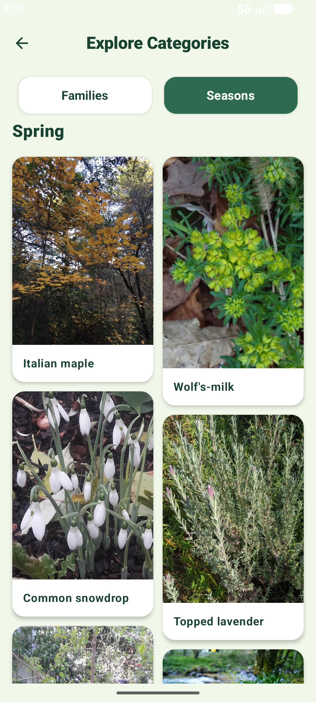

# Smart Recognizer (识花小助手)

一款基于 Jetpack Compose 开发的现代 Android 植物识别应用。集成了 PlantNet 图像识别、Trefle 植物数据库以及 DeepSeek AI 智能搜索功能，旨在为用户提供从识别、查询到收藏的一站式植物知识体验。

## 🌟 核心功能

- **智能识别**：利用 CameraX 结合 PlantNet API，快速精准识别多种植物。
- **植物百科**：海量植物数据库，支持按季节分类查看及关键字搜索。
- **AI 助手**：集成 DeepSeek 模型，提供专业的植物养护建议和知识解答。
- **个人收藏**：便捷收藏喜爱的植物，建立个人的“数字花园”。
- **精美 UI**：采用 Material 3 设计规范，支持深色模式与流畅动画。

## 📸 功能截图

| 主页预览 | 拍照识别 | 植物详情 |
| :---: | :---: | :---: |
|  |  |  |

| 百科搜索 | 个人收藏 | 分类功能 |
| :---: | :---: | :---: |
|  |  |  |


## ⚙️ 运行环境

- **最低 Android 版本**：Android 13.0 (API Level 33)
- **推荐 Android 版本**：Android 14.0 或更高
- **硬件要求**：需具备相机权限及联网环境

## 📦 APK 下载

>[Download APK](https://github.com/yanxingyu894-max/PlantRecognize-MVP/releases/download/v1.0-release/app-debug.apk)

> 你也可以在 [Releases 页面](https://github.com/yanxingyu894-max/PlantRecognize-MVP/releases/tag/v1.0-release) 查看所有历史版本。


## 📂 项目结构

```text
com.example.afinal
├── data/
│   ├── local/        # Room 数据库配置与 DAO
│   ├── remote/       # Retrofit API 服务接口 (PlantNet, Trefle, DeepSeek)
│   ├── repository/   # 数据仓库层，处理本地与远程数据逻辑
│   └── model/        # 数据实体类与 DTO
├── ui/
│   ├── screens/      # 各功能模块的 Compose 界面
│   ├── viewmodel/    # 业务逻辑与界面状态管理
│   ├── component/    # 通用自定义 Compose 组件
│   └── theme/        # 应用主题与颜色配置
└── util/             # 工具类（网络、权限、图片处理等）
```

## 🛠️ 技术栈

- **UI**: Jetpack Compose (Material 3)
- **网络**: Retrofit + OkHttp
- **数据库**: Room
- **图片加载**: Coil
- **相机**: CameraX
- **架构**: [MVVM (Model-View-ViewModel)](ARCHITECTURE.md)

---
*本项目仅供学习与交流使用。*
